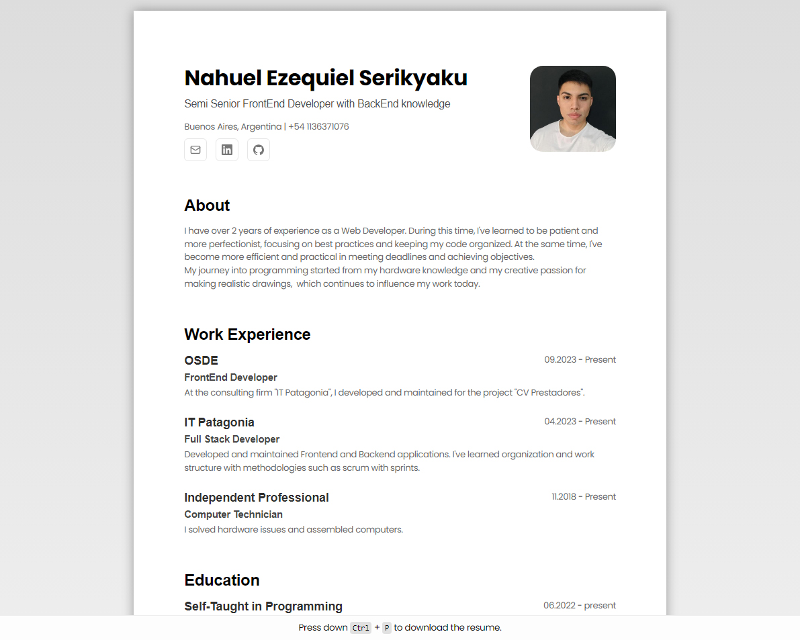

# CV.json to CV.pdf 

Developed using Static Site Generation without JavaScript in client.

An efficient way to update the information on your resume, without ruining the design and modifying a single file.

Scheme of the cv.json from [jsonresume.org](https://jsonresume.org/schema)

Based on the design of [Bartosz Jarocki](https://github.com/BartoszJarocki/cv)




# 🚀 Getting Started

1. Clone this repository to your local machine:

   ```bash
   git clone https://github.com/NahuelSerikyaku/cv.json-to-cv.pdf.git
   ```

2. Move to the cloned directory

   ```bash
   cd cv.json-to-cv
   ```

3. Install dependencies:

   ```bash
   pnpm install
   ```

4. Start the local Server:

   ```bash
   pnpm run dev
   ```

5. Open the [Config file](./src/data/cv.json) and make changes


# 🔑 License

[MIT](https://choosealicense.com/licenses/mit/)